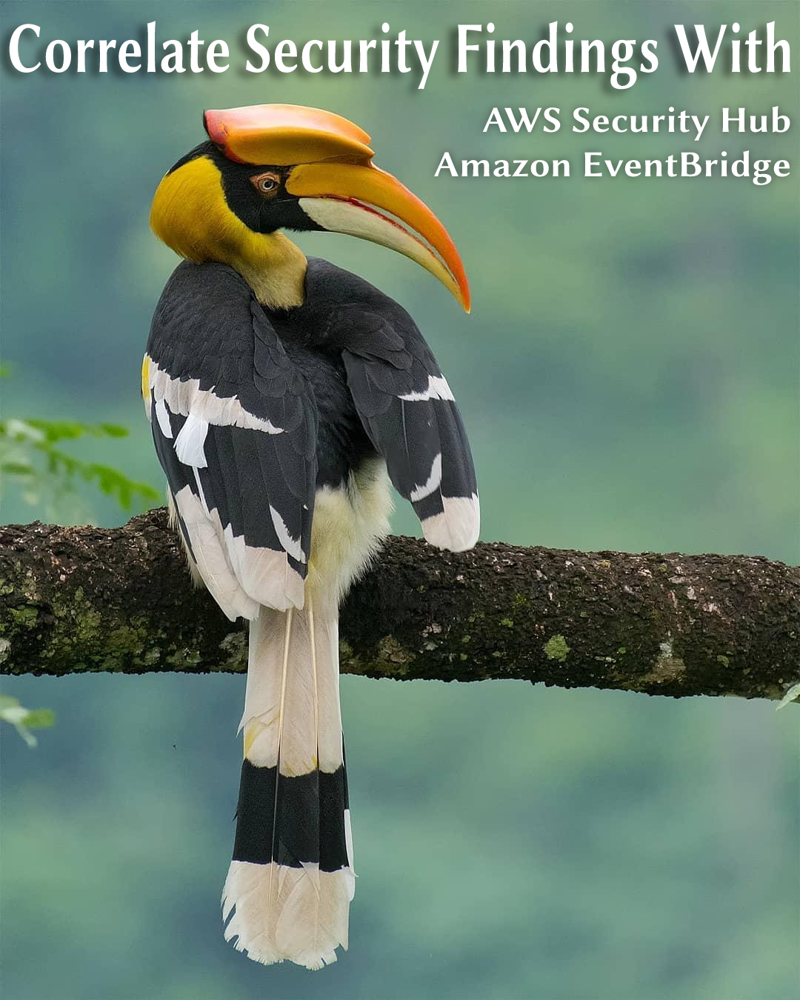
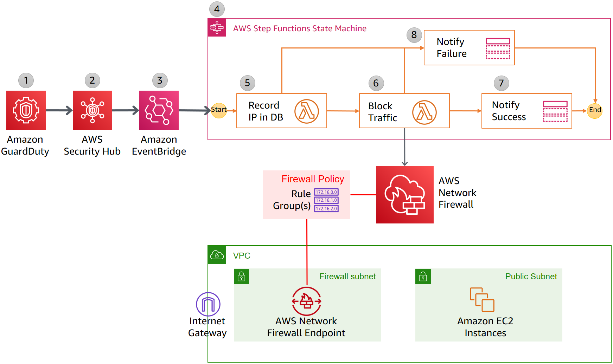
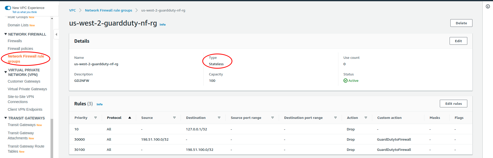
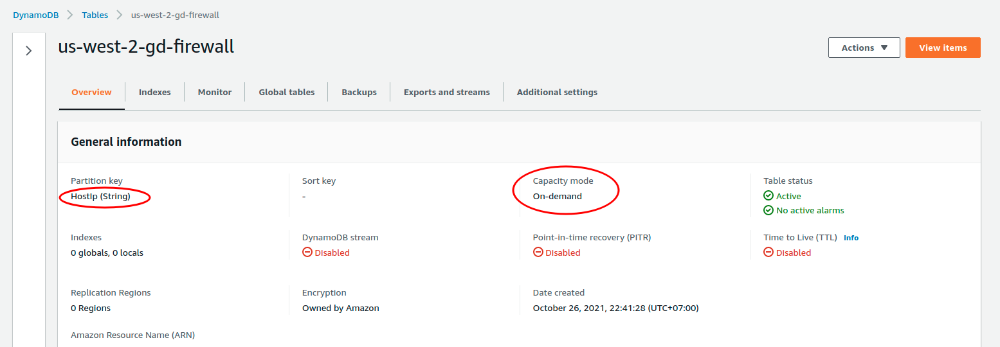
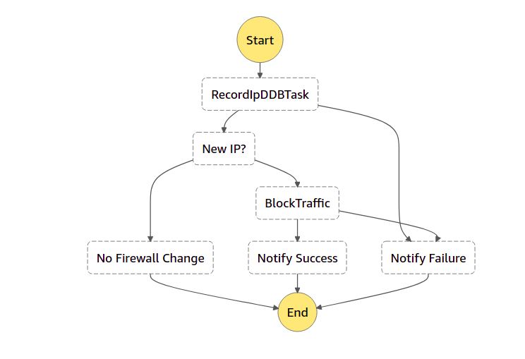
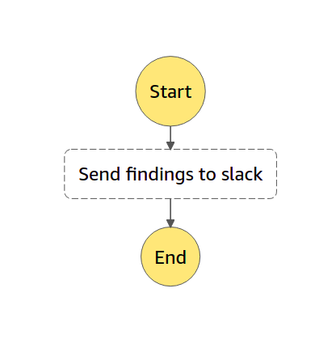
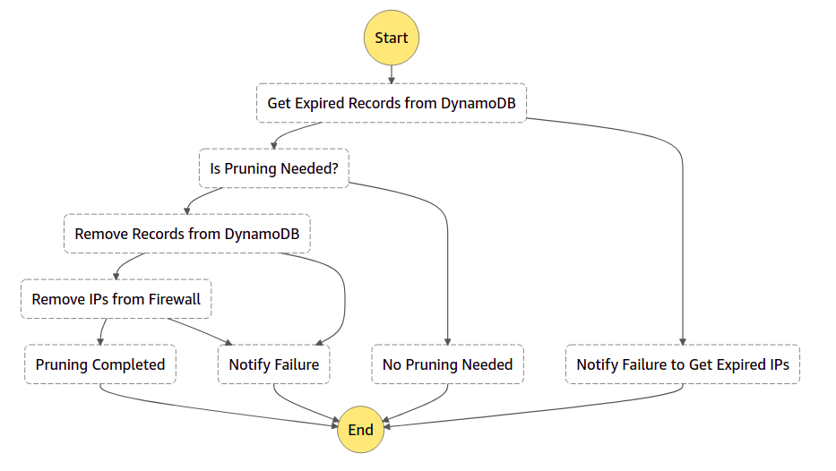
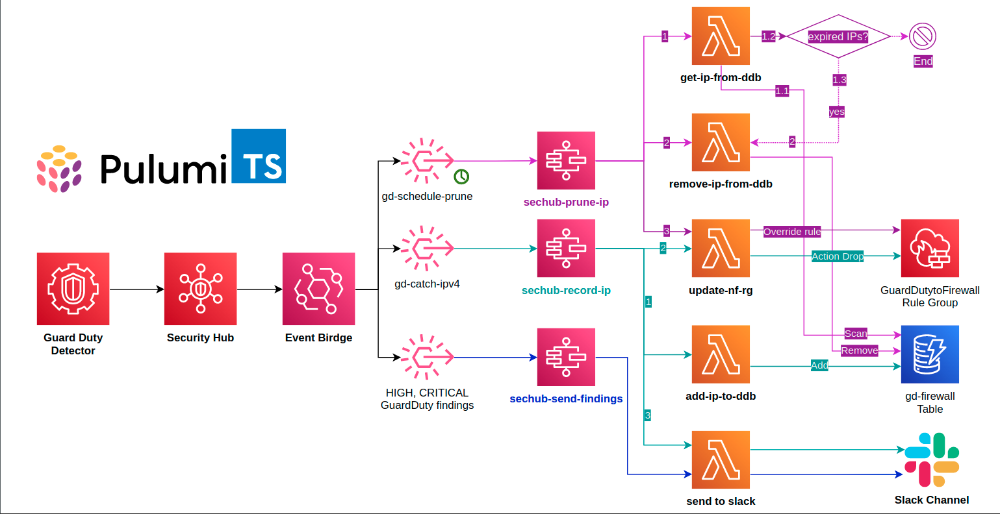
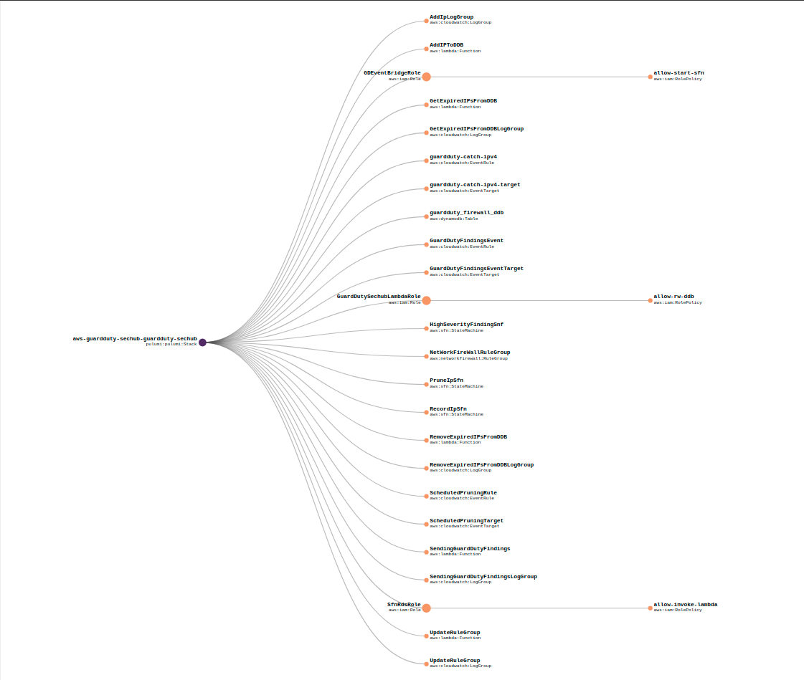

<p align="center">
  <a href="https://dev.to/vumdao">
    
  </a>
</p>
<h1 align="center">
  <div><b>Correlate Security Findings With AWS Security Hub and Amazon EventBridge</b></div>
</h1>

## Abstract
- Rather than spending time manually reacting to security alerts or looking at the GuardDuty/ Security hub dashboard, you can instead focus on activities such as enhancing application protection layers and improving your security program.
- This blog is a combine of AWS services such as guard duty, security hub, event bridge, step functions, network firewall rule group, lambda function and slack notification to provide the automation.
- And we use Pulumi to deploy those services as code.

## Table Of Contents
 * [Solution overview](#Solution-overview)
 * [Network Firewall Rule group](#Network-Firewall-Rule-group)
 * [Dynamodb table](#Dynamodb-table)
 * [EventBridge](#EventBridge)
 * [Step functions](#Step-functions)
 * [Lambda functions](#Lambda-functions)
 * [Using Pulumi to create infrastructure as code](#Using-Pulumi-to-create-infrastructure-as-code)
 * [Conclusion](#Conclusion)

---

## 🚀 **Solution overview** <a name="Solution-overview"></a>
- Amazon GuardDuty is a continuous security monitoring service that analyzes and processes data from VPC flow logs, cloudTrail, S3 data events, etc. Based on this data, GuardDuty analysis and detection by using threat intelligence feeds, signatures, anomaly detection, and machine learning in the AWS Cloud.

- The automation provides in this blog post is focused on blocking traffic to and from suspicious remote hosts. GuardDuty detection of unintended communication with remote hosts triggers a series of steps, including blocking of network traffic to those hosts by using Network Firewall, and notification of security operators.

- All in serverless by using eventBridge with event pattern from `aws.securityhub` source. For pattern matches such as HIGH or CRITICAL severity findings, as well as suspicious IP address, the event rule triggers step functions for remediation.

- AWS Step Functions is a serverless orchestration service that lets you combine AWS Lambda functions and other AWS services to build business-critical applications. Step Functions service also provides retry and error-handling logic, while Lambda functions interact with networking controls to block traffic, and with a database to store data about blocked remote IP addresses.



---

## **How it works?**

## 🚀 **Network Firewall Rule group** <a name="Network-Firewall-Rule-group"></a>
- This rulegroup is used to block traffic to and from suspicious remote hosts using `STATELESS` type and action `drop`



## 🚀 **Dynamodb table** <a name="Dynamodb-table"></a>
- The DDB tables is used to store the blocked IPs with attributes `HostIp`, `CreatedAt`
- Billing Mode: `PAY_PER_REQUEST`



## 🚀 **EventBridge** <a name="EventBridge"></a>
- Define rules with flowing patterns where the `source` is from `aws.securityhub`
    - catch-ipv4:
        ```
        {
            "detail": {
                "findings": {
                "ProductFields": {
                    "aws/guardduty/service/action/networkConnectionAction/remoteIpDetails/ipAddressV4": [{
                    "exists": true
                    }]
                }
                }
            },
            "detail-type": ["Security Hub Findings - Imported"],
            "region": ["us-west-2"],
            "source": ["aws.securityhub"]
        }
        ```

    - Other findings:
        ```
        {
            "detail": {
                "findings": {
                "Severity": {
                    "Label": ["HIGH", "CRITICAL"]
                }
                }
            },
            "detail-type": ["Security Hub Findings - Imported"],
            "region": ["us-west-2"],
            "source": ["aws.securityhub"]
        }
        ```

## 🚀 **Step functions** <a name="Step-functions"></a>
- **sechub-record-ip**: include three lambda functions `add_ip_func`, `update_rule_group_func`, `send_finding_func`

    

- **sechub-send-findings**: which use lamdba function resource `send_finding_func`

    

- **sechub-prune-ip**: lambda functions `get_ip_func`, `remove_ip_func`, `send_finding_func`, `update_rule_group_func`

    

## 🚀 **Lambda functions** <a name="Lambda-functions"></a>
- **add-ip-to-ddb**: The function parses the event to get `HostIp` and then adds it to Dynamodb (DDB) table, if it's actually new IP then return a record which includes IP list and flag `NewIP=True`, otherwise, flag `NewIP=False` due to IP already exists in DDB

- **get-ip-from-ddb**: This function is called by scheduled statemachine to get all blocked IPs in DDB which are expired (blocking time > 720 hours)

- **remove-ip-from-ddb**: Base on the input of expired IPs from previous step functions, remove those IPs from DDB and then return the rest of IPs

- **update-nf-rg**: This function override current Network firewall rule group with the input combine with current

- **send-gd-finding**: This function send notification of success or failure for any blocking IPs or high/critical findings.

---

## We walked through all resources which are going to deploy in this solution, see the flow more detail



## 🚀 **Using Pulumi to create infrastructure as code** <a name="Using-Pulumi-to-create-infrastructure-as-code"></a>
- Source code in `TypeScript`: [aws-guardduty-sechub GitHub repository](https://github.com/vumdao/aws-guardduty-sechub). The following commands show how to deploy the solution using Pulumi

- First, need to set Pulumi configs such as AWS region, AWS account, AWS profile and webhook URL of slack channel
    ```
    pulumi config set aws:region us-west-2
    pulumi config set aws:profile myprofile
    pulumi config set --secret aws-guardduty-sechub:webhook_url https://slack.channel.com/<ID>
    ```
- Preview the stack
    ```
    pulumi preview
    ```

- Deploy stack
    ```
    pulumi up
    ```

- Check result on Pulumi graph view



## 🚀 **Conclution** <a name="Conclution"></a>
- In this blog post, we walked through a solution to use AWS services, including Amazon EventBridge, AWS step function, AWS Lambda, and Amazon DynamoDB, to correlate AWS Security Hub findings from multiple different AWS security services.
- By automating blocking traffic from suspicious IP addresses and sending high and critical findings to slack, we can prioritize and improve our security response.

---

References:
- [Automatically block suspicious traffic with AWS Network Firewall and Amazon GuardDuty](https://aws.amazon.com/blogs/security/automatically-block-suspicious-traffic-with-aws-network-firewall-and-amazon-guardduty)
- [Correlate security findings with AWS Security Hub and Amazon EventBridge](https://aws.amazon.com/blogs/security/correlate-security-findings-with-aws-security-hub-and-amazon-eventbridge/)


<h3 align="center">
  <a href="https://dev.to/vumdao">:stars: Blog</a>
  <span> · </span>
  <a href="https://github.com/vumdao/aws-guardduty-sechub">Github</a>
  <span> · </span>
  <a href="https://stackoverflow.com/users/11430272/vumdao">Web</a>
  <span> · </span>
  <a href="https://www.linkedin.com/in/vu-dao-9280ab43/">Linkedin</a>
  <span> · </span>
  <a href="https://www.linkedin.com/groups/12488649/">Group</a>
  <span> · </span>
  <a href="https://www.facebook.com/CloudOpz-104917804863956">Page</a>
  <span> · </span>
  <a href="https://twitter.com/VuDao81124667">Twitter :stars:</a>
</h3>

